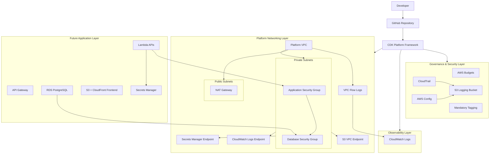
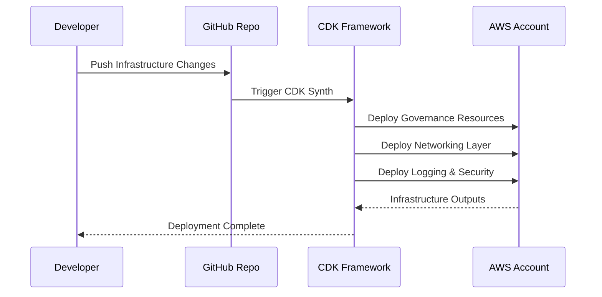

# Day0 CloudKit Platform Architecture

## Overview

This diagram represents the current architecture of the reusable SMB cloud bootstrap platform built using AWS CDK and TypeScript.

The platform currently includes:

- Multi-environment configuration
- Platform governance layer
- Centralized logging
- CloudTrail baseline
- AWS Config baseline
- Reusable VPC architecture
- Flow logs
- Budget alerts
- Tagging governance
- VPC endpoints
- Security group strategy

---

# High-Level Architecture Diagram



---

# Platform Repository Structure

```txt
platform-infra/
├── bin/
│   └── platform-infra.ts
│
├── config/
│   ├── dev.ts
│   ├── stage.ts
│   ├── prod.ts
│   └── types.ts
│
├── lib/
│   └── platform-stack.ts
│
├── packages/
│   ├── networking/
│   │   ├── platform-vpc.ts
│   │   └── security-groups.ts
│   │
│   ├── security/
│   │   ├── cloudtrail-baseline.ts
│   │   └── config-baseline.ts
│   │
│   ├── storage/
│   │   ├── secure-bucket.ts
│   │   └── logging-bucket.ts
│   │
│   ├── finops/
│   │   └── budget-alert.ts
│   │
│   └── governance/
│       └── tags.ts
│
├── scripts/
├── test/
└── package.json
```

---

# Deployment Flow



---

# Current Platform Components

| Layer                | Components                       |
| -------------------- | -------------------------------- |
| Governance           | AWS Budgets, Mandatory Tags      |
| Security             | CloudTrail, AWS Config           |
| Logging              | Centralized S3 Logging Bucket    |
| Networking           | VPC, Public/Private Subnets, NAT |
| Observability        | Flow Logs, CloudWatch            |
| Connectivity         | VPC Endpoints                    |
| Security Controls    | Reusable Security Groups         |
| Platform Engineering | Reusable CDK Constructs          |

---

# Planned Future Enhancements

## Compute Layer

- Lambda API pattern
- ECS Fargate pattern
- API Gateway integration

## Data Layer

- RDS PostgreSQL construct
- DynamoDB pattern
- Backup policies

## CI/CD

- CodePipeline integration
- CodeBuild integration
- Cross-account deployments

## Security

- GuardDuty baseline
- Security Hub integration
- IAM permission boundaries

## Observability

- Dashboards
- Alarms
- Metric filters
- Centralized monitoring

## Cost Optimization

- Auto shutdown scheduler
- Ephemeral environments
- Idle resource cleanup

---

# Architecture Principles

## Secure by Default

All constructs enforce:

- encryption
- SSL
- restricted access
- centralized governance

## Cost Optimized

Designed for SMB environments:

- single NAT gateway
- VPC endpoints
- lifecycle policies
- budget alerts

## Reusable

All infrastructure built as:

- reusable CDK constructs
- platform modules
- composable abstractions

## Observable

Platform includes:

- audit logs
- flow logs
- CloudWatch integration
- governance visibility

## Environment Aware

Supports:

- dev
- stage
- prod
- future multi-account expansion

# Day0 CloudKit — Cost & FinOps Strategy

# Overview

This document captures the cost optimization philosophy, baseline infrastructure costs, and FinOps-related design decisions for the Day0 CloudKit SMB cloud bootstrap platform.

The platform is intentionally designed for:

- small and mid-sized businesses (SMBs)
- early-stage cloud adoption
- low operational overhead
- governance-first infrastructure
- cost-aware scalability

The objective is to provide a reusable cloud foundation that balances:

- scalability
- operational visibility
- governance
- affordability

without introducing unnecessary enterprise-level complexity.

---

# Cost Optimization Philosophy

The platform follows several core FinOps principles:

## 1. Secure by Default

Security and governance controls are implemented early to avoid expensive operational mistakes later.

Examples:

- centralized logging
- CloudTrail
- AWS Config
- mandatory tagging
- VPC Flow Logs

---

## 2. Cost-Aware Networking

Networking architecture is designed specifically to minimize recurring AWS networking costs.

Examples:

- single NAT Gateway
- selective VPC endpoints
- private subnet design
- controlled flow log retention

---

## 3. Operational Simplicity

The platform prioritizes:

- maintainability
- lower operational burden
- reduced service sprawl

instead of introducing unnecessary enterprise-scale complexity during initial adoption.

---

## 4. Governance Before Scale

Governance services are implemented before application workloads to avoid:

- visibility gaps
- uncontrolled cost growth
- security drift
- unmanaged resource sprawl

---

# Current Infrastructure Components

| Layer             | Services                       |
| ----------------- | ------------------------------ |
| Governance        | AWS Budgets, Mandatory Tags    |
| Security          | CloudTrail, AWS Config         |
| Logging           | S3 Logging Bucket              |
| Networking        | VPC, NAT Gateway, Subnets      |
| Observability     | VPC Flow Logs, CloudWatch Logs |
| Connectivity      | VPC Endpoints                  |
| Security Controls | Security Groups                |

---

# Estimated Monthly Cost Breakdown

## Assumptions

The following estimates assume:

- AWS us-east-1 region
- low-to-moderate development usage
- single environment deployment
- limited outbound traffic
- SMB-scale workloads
- no production-scale compute yet

Costs may vary depending on:

- traffic
- logging volume
- NAT Gateway usage
- CloudWatch retention
- future workloads

---

# Core Infrastructure Cost Estimate

| AWS Service              | Purpose                         | Estimated Monthly Cost (USD) |
| ------------------------ | ------------------------------- | ---------------------------- |
| Amazon VPC               | Base networking infrastructure  | $0                           |
| Public & Private Subnets | Network segmentation            | $0                           |
| Internet Gateway         | Internet connectivity           | $0                           |
| NAT Gateway              | Private subnet outbound access  | $30 – $45                    |
| VPC Flow Logs            | Network observability           | $1 – $10                     |
| CloudWatch Logs          | Flow log storage                | $1 – $5                      |
| Amazon S3 Logging Bucket | Centralized audit storage       | $1 – $3                      |
| AWS CloudTrail           | Audit logging                   | $2 – $10                     |
| AWS Config               | Resource configuration tracking | $3 – $15                     |
| AWS Budgets              | Billing alerts                  | Negligible                   |
| VPC Endpoints            | Private AWS service access      | $5 – $15                     |
| IAM Roles & Policies     | Access management               | $0                           |
| Security Groups          | Traffic control                 | $0                           |

---

# Estimated Baseline Monthly Total

## Development / Sandbox Environment

Estimated monthly range:

```txt
$45 – $90 / month
```

Primary cost drivers:

- NAT Gateway
- VPC endpoints
- AWS Config
- CloudWatch Logs

---

# Highest Cost Contributors

## NAT Gateway

### Why Expensive

AWS charges for:

- hourly NAT Gateway uptime
- outbound data processing

NAT Gateways frequently become the largest hidden cost in small AWS environments.

### Mitigation Strategy

The platform uses:

- single NAT Gateway
- VPC endpoints
- private AWS service connectivity

instead of multi-AZ NAT architectures.

---

## AWS Config

### Why Expensive

AWS Config pricing scales with:

- resource count
- configuration evaluations
- compliance rules

### Mitigation Strategy

Current implementation focuses on:

- foundational configuration recording
- limited baseline governance
- SMB-focused visibility

without advanced enterprise compliance packs initially.

---

## CloudWatch Logs

### Why Expensive

CloudWatch costs scale with:

- ingestion volume
- retention duration
- query activity

### Mitigation Strategy

The platform uses:

- one-month retention
- controlled observability scope
- limited log ingestion initially

---

# Cost Optimization Decisions

## Single NAT Gateway Strategy

### Decision

Use one NAT Gateway instead of one NAT per Availability Zone.

### Benefits

- significantly lower baseline networking cost
- simpler SMB architecture

### Tradeoff

Reduced high availability for outbound internet access.

---

## VPC Endpoint Strategy

### Decision

Add VPC endpoints for:

- S3
- CloudWatch Logs
- Secrets Manager

### Benefits

- reduced NAT data processing cost
- improved private AWS connectivity
- lower public internet exposure

### Tradeoff

Additional endpoint management complexity.

---

## Lifecycle-Based Logging Strategy

### Decision

Use lifecycle rules and log retention policies.

### Benefits

- reduced long-term storage cost
- controlled observability growth

### Tradeoff

Reduced historical log retention.

---

# Planned Future Cost Optimizations

## Ephemeral Environments

Planned support for:

- temporary development environments
- automatic cleanup
- pull-request-based deployments

Benefits:

- reduced idle infrastructure cost
- better developer isolation

---

## Automated Shutdown Scheduler

Planned implementation:

- scheduled shutdown for non-production resources
- office-hour-based uptime scheduling

Benefits:

- lower compute cost
- reduced idle runtime waste

---

## Infrastructure TTL Policies

Planned support for:

- resource expiration tags
- automatic cleanup workflows
- stale environment detection

Benefits:

- prevents forgotten infrastructure
- reduces long-term resource sprawl

---

# FinOps Design Principles

## Visibility First

The platform prioritizes:

- budget alerts
- centralized logging
- mandatory tagging
- audit visibility

before scaling workloads.

---

## Scale Gradually

The platform intentionally avoids:

- premature enterprise complexity
- excessive managed services
- overengineered networking patterns

until operational maturity requires them.

---

## Reuse Infrastructure Patterns

Reusable CDK constructs reduce:

- duplicated infrastructure
- inconsistent security controls
- governance drift

---

## Optimize for SMB Adoption

The platform prioritizes:

- affordability
- simplicity
- operational clarity
- reusable architecture

rather than enterprise-scale optimization initially.

---

# Future FinOps Enhancements

Planned future improvements include:

- AWS Cost Explorer dashboards
- automated idle resource detection
- resource TTL automation
- environment-based cost allocation
- team-level cost tagging
- anomaly detection
- centralized cost dashboards
- infrastructure usage analytics

---

# Recommended Deployment Environments

| Environment | Purpose                     |
| ----------- | --------------------------- |
| Sandbox     | Learning & experimentation  |
| Dev         | Active platform development |
| Stage       | Integration validation      |
| Prod        | Stable production workloads |

---

# Long-Term Platform Vision

The long-term objective of Day0 CloudKit is to provide:

- reusable cloud operating models
- governance-first infrastructure
- SMB-focused platform engineering patterns
- scalable cloud foundations
- cost-aware architecture standards

while maintaining:

- operational simplicity
- developer productivity
- infrastructure reusability
- cloud
