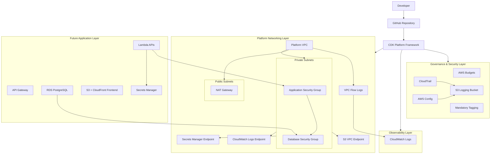
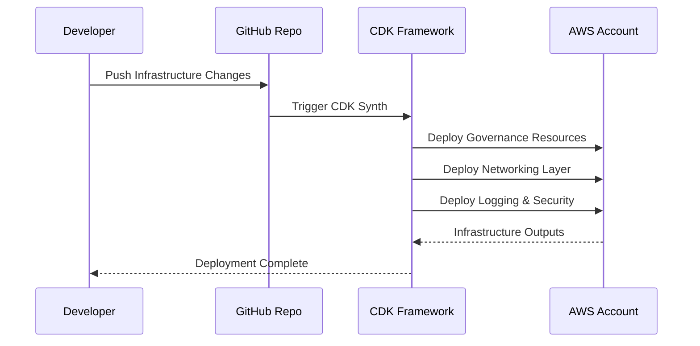

# Day0 CloudKit Platform Architecture

## Overview

This diagram represents the current architecture of the reusable SMB cloud bootstrap platform built using AWS CDK and TypeScript.

The platform currently includes:

- Multi-environment configuration
- Platform governance layer
- Centralized logging
- CloudTrail baseline
- AWS Config baseline
- Reusable VPC architecture
- Flow logs
- Budget alerts
- Tagging governance
- VPC endpoints
- Security group strategy

---

# High-Level Architecture Diagram



---

# Platform Repository Structure

```txt
platform-infra/
├── bin/
│   └── platform-infra.ts
│
├── config/
│   ├── dev.ts
│   ├── stage.ts
│   ├── prod.ts
│   └── types.ts
│
├── lib/
│   └── platform-stack.ts
│
├── packages/
│   ├── networking/
│   │   ├── platform-vpc.ts
│   │   └── security-groups.ts
│   │
│   ├── security/
│   │   ├── cloudtrail-baseline.ts
│   │   └── config-baseline.ts
│   │
│   ├── storage/
│   │   ├── secure-bucket.ts
│   │   └── logging-bucket.ts
│   │
│   ├── finops/
│   │   └── budget-alert.ts
│   │
│   └── governance/
│       └── tags.ts
│
├── scripts/
├── test/
└── package.json
```

---

# Deployment Flow



---

# Current Platform Components

| Layer                | Components                       |
| -------------------- | -------------------------------- |
| Governance           | AWS Budgets, Mandatory Tags      |
| Security             | CloudTrail, AWS Config           |
| Logging              | Centralized S3 Logging Bucket    |
| Networking           | VPC, Public/Private Subnets, NAT |
| Observability        | Flow Logs, CloudWatch            |
| Connectivity         | VPC Endpoints                    |
| Security Controls    | Reusable Security Groups         |
| Platform Engineering | Reusable CDK Constructs          |

---

# Planned Future Enhancements

## Compute Layer

- Lambda API pattern
- ECS Fargate pattern
- API Gateway integration

## Data Layer

- RDS PostgreSQL construct
- DynamoDB pattern
- Backup policies

## CI/CD

- CodePipeline integration
- CodeBuild integration
- Cross-account deployments

## Security

- GuardDuty baseline
- Security Hub integration
- IAM permission boundaries

## Observability

- Dashboards
- Alarms
- Metric filters
- Centralized monitoring

## Cost Optimization

- Auto shutdown scheduler
- Ephemeral environments
- Idle resource cleanup

---

# Architecture Principles

## Secure by Default

All constructs enforce:

- encryption
- SSL
- restricted access
- centralized governance

## Cost Optimized

Designed for SMB environments:

- single NAT gateway
- VPC endpoints
- lifecycle policies
- budget alerts

## Reusable

All infrastructure built as:

- reusable CDK constructs
- platform modules
- composable abstractions

## Observable

Platform includes:

- audit logs
- flow logs
- CloudWatch integration
- governance visibility

## Environment Aware

Supports:

- dev
- stage
- prod
- future multi-account expansion
